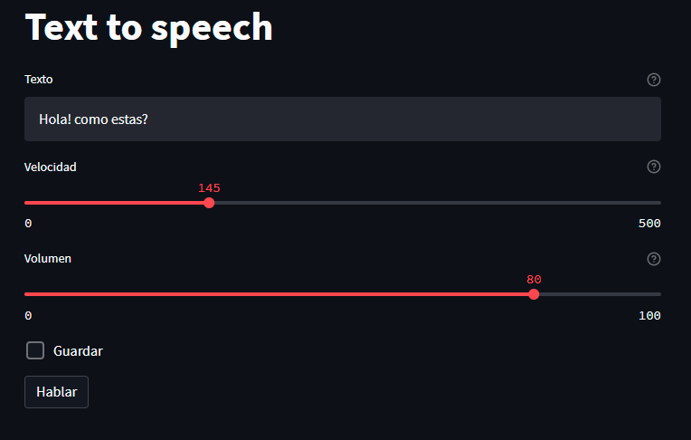

# :loud_sound: Demo text to speech

[]()



Demo text to speech utilizando pyttsx3. Se utiliza streamlit para el diseño web.

## :floppy_disk: Instalación

Crear ambiente virtual:

```shell
python -m venv env
```

Activar entorno virtual:

- En windows:

```shell
env/scripts/activate
```

- En mac:

```shell
source env/bin/activate
```

Actualizar pip:

```shell
python.exe -m pip install --upgrade pip
```

Instalar los requerimientos:

```shell
pip install -r requirements.txt
```

## :runner: Run

```shell
streamlit streamlit_app.py
```
